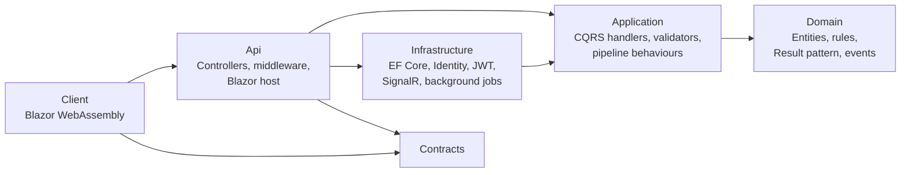
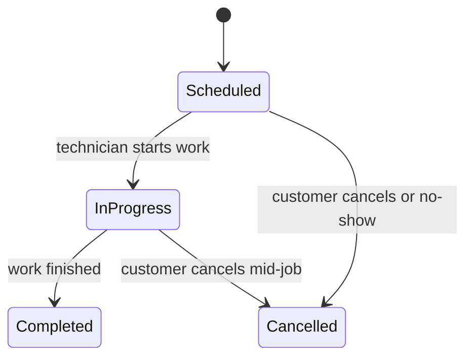

# MechanicShop

Workshop management system for automotive repair shops. It manages customers, vehicles, repair task templates, work orders, technician assignment, bay scheduling and invoicing behind a single role-based web application and REST API.

Built with .NET 9, ASP.NET Core, Blazor WebAssembly and SQL Server, following Clean Architecture and CQRS.

---

## Table of Contents

- [Problem](#problem)
- [Solution](#solution)
- [Features](#features)
- [Architecture](#architecture)
- [Project Structure](#project-structure)
- [Domain Rules](#domain-rules)
- [Tech Stack](#tech-stack)
- [Getting Started](#getting-started)
- [Docker](#docker)
- [Configuration](#configuration)
- [API](#api)
- [Testing](#testing)
- [Observability](#observability)
- [Seed Data](#seed-data)

---

## Problem

Repair shops commonly run on paper logs and spreadsheets. This leads to recurring operational failures:

- Technicians and service bays are double-booked.
- Nobody has a reliable view of which jobs are scheduled, in progress or finished.
- Customers who do not show up keep a bay blocked for the rest of the day.
- Standard repair procedures are re-typed on every job, with inconsistent pricing.
- Business rules (who may change what, and when) are enforced informally, if at all.

## Solution

MechanicShop is a single source of truth for workshop operations. Scheduling rules are enforced in the domain and application layers, so they cannot be bypassed from the UI or the API:

- Overlapping assignments for the same technician, service bay or vehicle are rejected.
- Work order state follows a strict lifecycle; invalid transitions return explicit errors.
- Scheduled work orders are cancelled automatically when a customer is more than 15 minutes late.
- Repair tasks are reusable templates, so cost and duration are defined once and reused across work orders.
- Access is split between **Manager** (full control) and **Labor** (own work orders only).

## Features

| Area | Capabilities |
|---|---|
| Customers and vehicles | CRUD with validation, protection against deleting customers that have work orders |
| Repair task catalog | Reusable templates with parts, estimated cost and duration |
| Work orders | Create, relocate, reassign technician, update tasks, state transitions, delete |
| Scheduling | Daily schedule by date, four service bays (A-D), conflict detection, minimum duration, operating hours |
| Labor | Technician listing and availability, self-scoped access to assigned work orders |
| Dashboard | Work order statistics by date (total, completed, in progress, cancelled) |
| Billing | Invoice issuing, PDF generation, payment settlement |
| Real time | SignalR hub pushes work order changes to connected clients |
| Auth | JWT access tokens with refresh tokens, role and policy-based authorization |

## Architecture

The solution follows Clean Architecture. Dependencies point inward: the domain has no knowledge of infrastructure, and the application layer depends only on abstractions that infrastructure implements.



### Layers

| Layer | Responsibility |
|---|---|
| **Domain** | Entities (`WorkOrder`, `Customer`, `Vehicle`, `RepairTask`, `Part`, `Employee`, `Invoice`), state machine, domain events, error definitions and the `Result<T>` type. No framework dependencies beyond MediatR abstractions. |
| **Application** | Use cases organised by feature as commands and queries (MediatR), FluentValidation validators, DTOs and mappers, and the interfaces infrastructure must implement (`IAppDbContext`, `IWorkOrderPolicy`, `ITokenProvider`, ...). |
| **Infrastructure** | EF Core with SQL Server, entity configurations and migrations, ASP.NET Core Identity, JWT generation, hybrid caching, PDF generation, SignalR notifier, and the auto-cancellation background service. |
| **Api** | HTTP surface: versioned controllers, global exception handling, rate limiting, CORS, output caching, OpenAPI, and the host for the Blazor client. |
| **Contracts** | Request and response models shared between the API and the client. |
| **Client** | Blazor WebAssembly UI: schedule, work orders, customers, repair tasks, billing, dashboard. |

### Patterns and decisions

- **CQRS with MediatR.** Every use case is a command or query with its own handler and validator, grouped by feature folder.
- **Pipeline behaviours.** Cross-cutting concerns wrap every request: validation, performance logging, unhandled exception logging and query caching.
- **Result pattern.** Expected failures (validation, not found, conflict) are returned as typed `Error` values rather than thrown, and mapped to RFC 7807 problem details at the API boundary.
- **Rich domain model.** Entities expose behaviour and guard their own invariants. State changes go through methods such as `UpdateState`, `Cancel` and `UpdateTiming`; setters are private.
- **Domain events.** `WorkOrderCompleted` and `WorkOrderCollectionModified` are raised by the domain and dispatched when changes are saved. Handlers send notifications and push real-time updates.
- **Audit trail.** An EF Core `SaveChanges` interceptor stamps created and modified metadata on auditable entities.
- **Two-level caching.** Queries implementing `ICachedQuery` are cached through `HybridCache` (in-memory plus distributed-ready), with tag-based invalidation. HTTP output caching is applied on top.
- **Policy-based authorization.** `ManagerOnly` and `SelfScopedWorkOrderAccess` (a technician may act only on work orders assigned to them).

## Project Structure

```
.
├── src/
│   ├── MechanicShop.Domain/          Entities, state machine, domain events, Result type
│   ├── MechanicShop.Application/     Use cases (Features/*), behaviours, interfaces, DTOs
│   ├── MechanicShop.Infrastructure/  EF Core, Identity, JWT, SignalR, background jobs
│   ├── MechanicShop.Contracts/       Shared request/response models
│   ├── MechanicShop.Api/             Controllers, middleware, DI composition, Blazor host
│   └── MechanicShop.Client/          Blazor WebAssembly UI
├── tests/
│   ├── MechanicShop.Domain.UnitTests/
│   ├── MechanicShop.Application.UnitTests/
│   ├── MechanicShop.Application.SubcutaneousTests/
│   ├── MechanicShop.Api.IntegrationTests/
│   └── MechanicShop.Tests.Common/    Shared builders and test data
├── containers/                       Prometheus and Seq configuration
├── requests/                         Sample HTTP requests
├── Dockerfile
├── docker-compose.yml
├── Directory.Build.props             Shared build settings and StyleCop analyzers
└── Directory.Packages.props          Central NuGet package versions
```

Each feature in `Application/Features` is organised the same way:

```
Features/WorkOrders/
├── Commands/CreateWorkOrder/   Command, handler, validator
├── Queries/GetWorkOrders/      Query, handler
├── Dtos/
├── Mappers/
└── EventHandlers/
```

## Domain Rules

### Work order lifecycle



`Completed` and `Cancelled` are terminal. Any other transition is rejected with a descriptive error.

### Scheduling and access rules

- A technician cannot have two overlapping work orders.
- A service bay (A-D) cannot host two overlapping work orders.
- A vehicle cannot be scheduled twice at the same time.
- Work orders must meet the configured minimum duration and fall within operating hours.
- Work orders that are `InProgress` cannot be edited, rescheduled or deleted.
- Scheduled work orders still not started 15 minutes after their start time are cancelled automatically by a background service.
- Only managers create, reschedule, reassign and delete work orders. Technicians can update the state of their own assigned work orders only.
- A customer with work orders cannot be deleted.
- Deleting a repair task template does not affect work orders that already reference it.

## Tech Stack

| Concern | Technology |
|---|---|
| Runtime | .NET 9, C# (nullable enabled) |
| Web | ASP.NET Core, API versioning (`/api/v1`) |
| UI | Blazor WebAssembly |
| Data | EF Core 9, SQL Server 2022 |
| Messaging | MediatR |
| Validation | FluentValidation |
| Auth | ASP.NET Core Identity, JWT bearer, refresh tokens |
| Real time | SignalR |
| Caching | HybridCache, ASP.NET Core output caching |
| Documents | QuestPDF |
| Docs | OpenAPI, Swagger UI, Scalar |
| Observability | Serilog, Seq, OpenTelemetry, Prometheus, Grafana |
| Testing | xUnit, NSubstitute, Testcontainers (SQL Server) |
| Quality | StyleCop analyzers, `.editorconfig`, central package management |

## Getting Started

### Prerequisites

- .NET 9 SDK
- SQL Server (local instance, or run it through Docker)
- Docker Desktop (optional, for the full stack)

### Run locally

1. Set the connection string in `src/MechanicShop.Api/appsettings.Development.json` (or via user secrets / environment variable `ConnectionStrings__DefaultConnection`).

2. Start the application:

   ```bash
   dotnet run --project src/MechanicShop.Api
   ```

In `Development`, the application applies migrations and seeds data on startup. The API listens on `http://localhost:5001` (and `https://localhost:7007`), and the Blazor client is served by the same host.

- Web application: `/`
- Swagger UI: `/swagger`
- Scalar API reference: `/scalar`

## Docker

The `Dockerfile` is a multi-stage build: the .NET SDK image restores and publishes the API (which includes the Blazor client), and the final stage runs on the lightweight `aspnet:9.0` runtime image. Project files are copied and restored before the sources so the restore layer is cached between builds.

`docker-compose.yml` defines the full environment:

| Service | Image | Port | Purpose |
|---|---|---|---|
| `mechanicshop-api` | built from `Dockerfile` | 5001 | API and Blazor client |
| `sqlserver` | `mssql/server:2022-latest` | 1433 | Database, persisted in the `sqlserver-data` volume |
| `seq` | `datalust/seq` | 8081 (UI), 5341 (ingest) | Structured logs and traces |
| `prometheus` | `prom/prometheus` | 9090 | Metrics scraping |
| `grafana` | `grafana/grafana` | 3000 | Metrics dashboards |

All services share the `mechanicshop-net` bridge network. The API waits for SQL Server and Seq to start, and restarts on failure.

```bash
docker compose up --build -d
```

Then open `http://localhost:5001`. Stop the stack with:

```bash
docker compose down
```

> The credentials in `docker-compose.yml` and `appsettings.json` (SQL `sa` password, JWT secret, Grafana admin password) are development placeholders. Replace them with secrets from your environment or a secret store before deploying anywhere shared.

## Configuration

Application settings live under the `AppSettings` section of `appsettings.json`:

| Setting | Default | Description |
|---|---|---|
| `OpeningTime` / `ClosingTime` | `00:00` / `23:59:59` | Operating hours used when validating work order timing |
| `MaxSpots` | `4` | Number of service bays |
| `MinimumAppointmentDurationInMinutes` | `30` | Minimum work order duration |
| `BookingCancellationThresholdMinutes` | `15` | Grace period before a no-show is cancelled |
| `OverdueBookingCleanupFrequencyMinutes` | `3` | How often the cleanup job runs |
| `LocalCacheExpirationInMins` / `DistributedCacheExpirationMins` | `5` | Cache lifetimes |
| `DefaultPageNumber` / `DefaultPageSize` | `1` / `10` | Pagination defaults |
| `AllowedOrigins` | see file | CORS origins |

Other sections: `ConnectionStrings:DefaultConnection`, `JwtSettings` (secret, issuer, audience, token lifetime) and `Serilog`.

## API

Controllers are versioned under `/api/v1`. All endpoints require authentication except token generation.

| Resource | Route | Access |
|---|---|---|
| Identity | `POST /identity/token/generate`, `POST /identity/token/refresh-token`, `GET /identity/current-user/claims` | Public (claims: authenticated) |
| Customers | `/api/v1/customers` | Read: any user. Write: Manager |
| Repair tasks | `/api/v1/repair-tasks` | Read: any user. Write: Manager |
| Work orders | `/api/v1/workorders` | Create, relocate, assign, delete: Manager. State update: Manager or assigned Labor |
| Schedule | `GET /api/v1/workorders/schedule/{date}` | Any user |
| Labors | `GET /api/v1/labors` | Any user |
| Dashboard | `GET /api/v1/dashboard/stats` | Any user |
| Invoices | `/api/v1/invoices` | Manager |

Errors are returned as RFC 7807 problem details with a `requestId` for log correlation. A sliding-window rate limiter policy (100 requests per minute) is registered and can be attached to endpoints with `[EnableRateLimiting("SlidingWindow")]`. Sample requests are in `requests/requests.http`.

## Testing

```bash
dotnet test
```

| Project | Scope |
|---|---|
| `Domain.UnitTests` | Entity behaviour, state transitions, invariants |
| `Application.UnitTests` | Pipeline behaviours, mappers |
| `Application.SubcutaneousTests` | Handlers executed through MediatR against a real SQL Server (Testcontainers) |
| `Api.IntegrationTests` | End-to-end HTTP tests via `WebApplicationFactory` and SQL Server (Testcontainers) |

The subcutaneous and integration suites start a SQL Server container, so Docker must be running.

The GitHub Actions workflow in `.github/workflows/build-and-test.yml` restores, builds in Release mode and runs the full test suite on pushes and pull requests.

## Observability

- **Logs:** Serilog writes structured logs to the console and Seq.
- **Tracing and metrics:** OpenTelemetry instruments ASP.NET Core and outgoing HTTP calls, and exports traces and metrics via OTLP (to Seq in the Docker setup). The Prometheus exporter is registered and `containers/prometheus/prometheus.yml` is provided for scraping.
- **Request correlation:** every request is enriched with a log context, and error responses carry a `requestId`.

## Seed Data

In `Development`, the initializer creates the `Manager` and `Labor` roles, sample users, and sample customers with vehicles.

| Role | Email |
|---|---|
| Manager | `pm@localhost` |
| Labor | `john.labor@localhost`, `peter.labor@localhost`, `kevin.labor@localhost` |

For these development accounts the initial password equals the email address. Seeding runs only in the `Development` environment and must not be used in production.
